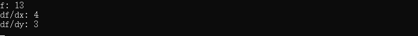

表达式
===========

在 ``VQNet`` 中执行反向传播时，我们使用网络的根变量来定义表达式。
表达式是一个变量包，它是一个保存变量信息并支持前向和后向传播的对象，在表达式上可以执行反向传播并获得损失函数的梯度。

接口介绍
---------------

.. cpp:class:: expression

   .. cpp:function:: expression(var root)

        **功能**
            通过一个变量来构造表达式。
        **参数**
            - root 表达式变量
        **返回值**
            无

   .. cpp:function:: var getRoot() const
      
        **功能**
            获取表达式对应的变量。
        **参数**
            无
        **返回值**
            表达式对应的变量。

   .. cpp:function:: std::vector<var> findLeaves()
      
        **功能**
            获取表达式变量的叶子节点。
        **参数**
            无
        **返回值**
            表达式变量的叶子节点。

   .. cpp:function:: MatrixXd propagate()

        **功能**
            对表达式进行前向传播赋值并计算表达式的值。
        **参数**
            无
        **返回值**
            表达式的值。

   .. cpp:function:: MatrixXd propagate(const std::vector<var>& leaves)

        **功能**
            通过指定的叶子节点对表达式进行前向传播赋值并计算表达式的值。
        **参数**
            - leaves 叶子节点
        **返回值**
            表达式的值。

   .. cpp:function:: std::unordered_set<var> findNonConsts(const std::vector<var>& leaves)

        **功能**
            找到从根节点到该给定叶子节点的所有非常量变量。 如果从根节点到叶子节点的路径中存在一些不相关的变量，则不会将其添加到集合中。
        **参数**
            - leaves 叶子节点
        **返回值**
            根节点到该给定叶子节点的所有非常量变量。

   .. cpp:function:: std::unordered_set<var> findNonConsts(const std::unordered_set<var>& leaves)

        **功能**
            重装函数。找到从根节点到该给定叶子节点的所有非常量变量。 如果从根节点到叶子节点的路径中存在一些不相关的变量，则不会将其添加到集合中。
        **参数**
            - leaves 叶子节点
        **返回值**
            根节点到该给定叶子节点的所有非常量变量。

   .. cpp:function:: void backpropagate(std::unordered_map<var, MatrixXd>& leaves)

        **功能**
            反向传播计算所有的梯度值。
        **参数**
            - leaves 待求变量与梯度值的映射
        **返回值**
            无
       
   .. cpp:function:: void backpropagate(std::unordered_map<var, MatrixXd>& leaves, const std::unordered_set<var>& nonconsts)

        **功能**
            反向传播计算非常量节点变量的梯度值。

        **参数**
            - leaves 待求变量与梯度值的映射
            - nonconsts 非常量节点变量
        **返回值**
            无

   .. cpp:function:: std::unordered_set<var> findVariables()

        **功能**
            查找该表示所有可微节点变量。
        **参数**
            无
        **返回值**
            表达式的值。

``VQNet`` 中还封装了一些实用接口用来计算变量的值及梯度值。

.. cpp:function:: MatrixXd eval(var v, bool iter)
   
    **功能**
        计算变量的值。
    **参数**
        - v 变量
        - iter 如果为true则计算变量中所有非常量孩子节点的值，否则全部节点都重新计算
    **返回值**
        变量节点的值。

.. cpp:function:: void back(const var& root, std::unordered_map<var, MatrixXd>& map)

    **功能**
        计算指定变量在根变量中的梯度值。
    **参数**
        - root 变量
        - map 待求变量与梯度值的映射
    **返回值**
        无

.. cpp:function:: void back(const expression& exp, std::unordered_map<var, MatrixXd>& map)

    **功能**
        计算指定变量在变量表达式中的梯度值。
    **参数**
        - exp 变量表达式
        - map 待求变量与梯度值的映射
    **返回值**
        无

.. cpp:function:: void back(const var& root, std::unordered_map<var, MatrixXd>& map, const std::unordered_set<var>& nonconsts)

    **功能**
        计算指定变量在根变量中的梯度值。
    **参数**
        - root 变量
        - map 待求变量与梯度值的映射
        - nonconsts 非常量节点变量
    **返回值**
        无

.. cpp:function:: void back(const expression& exp, std::unordered_map<var, MatrixXd>& map, const std::unordered_set<var>& nonconsts)

    **功能**
        计算指定变量在根变量中的梯度值。
    **参数**
        - exp 变量表达式
        - map 待求变量与梯度值的映射
        - nonconsts 非常量节点变量
    **返回值**
        无

实例
--------------

.. code-block:: cpp

    #include "Variational/var.h"
    #include "Variational/expression.h"
    #include "Variational/utils.h"

    int main()
    {
        using namespace QPanda;
        using namespace QPanda::Variational;

        var x(2);
        var y(3);

        var f = x*x + 3*y;
        expression exp(f);

        std::cout << "f: " << eval(f, true) << std::endl;

        std::unordered_map<var, MatrixXd> map;
        map.insert(std::make_pair(x, zeros_like(x.getValue())));
        map.insert(std::make_pair(y, zeros_like(y.getValue())));

        std::vector<var> leaves = { x, y };
        std::unordered_set<var> leaf_set = exp.findNonConsts(leaves);

        back(exp, map, leaf_set);
        //back(f, map, leaf_set);

        std::cout << "df/dx: " << map[x] << std::endl;
        std::cout << "df/dy: " << map[y] << std::endl;

        return 0;
    }

