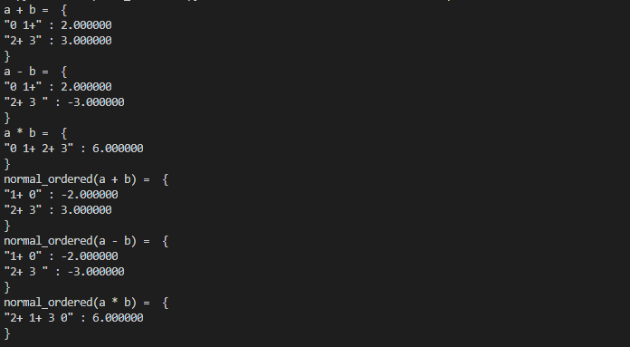

费米子算符类
==============

我们用如下的记号标识来表示费米子的两个形态，
湮没: :math:`X`  表示 :math:`a_x` ，
创建: :math:`X+` 表示 :math:`a_x^\dagger` ，
例如: "1+ 3 5+ 1"则代表 :math:`a_1^\dagger \ a_3 \ a_5^\dagger \ a_1`

整理规则如下

**1.** 不同数字

.. math:: "1 \quad 2" = -1 * "2 \quad 1"
.. math:: "1+ \quad 2+" = -1 * "2+ \quad 1+"
.. math:: "1+ \quad 2" = -1 * "2 \quad 1+"

**2.** 相同数字

.. math:: "1 \quad 1+" =  1 - "1+ \quad 1"
.. math:: "1+ \quad 1+" = 0
.. math:: "1 \quad 1" = 0

跟 ``PauliOperator`` 类似，``FermionOperator`` 类也提供了费米子算符之间加、减和乘的基础的运算操作。通过整理功能可以得到一份有序排列的结果。

实例
--------------

.. code-block:: python

    from pyqpanda import *
    
    if __name__=="__main__":

        a = FermionOperator("0 1+", 2)
        b = FermionOperator("2+ 3", 3)

        plus = a + b
        minus = a - b
        muliply = a * b

        print("a + b = ", plus)
        print("a - b = ", minus)
        print("a * b = ", muliply)

        print("normal_ordered(a + b) = ", plus.normal_ordered())
        print("normal_ordered(a - b) = ", minus.normal_ordered())
        print("normal_ordered(a * b) = ", muliply.normal_ordered())

