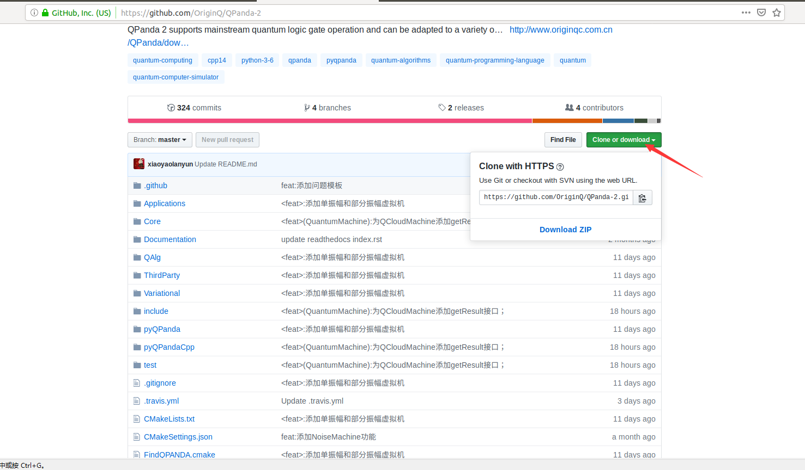
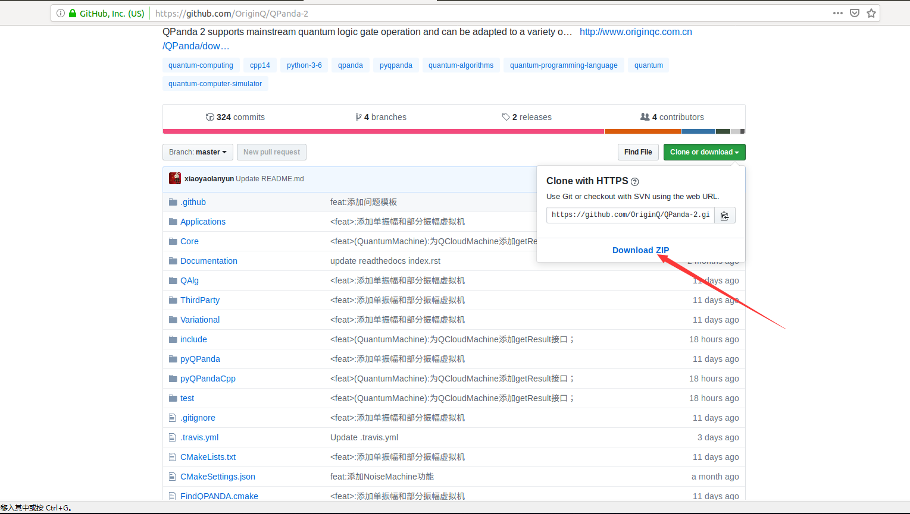

系统配置和下载
=========================

.. _pyqpanda: https://qpanda-2.readthedocs.io/zh_CN/latest/
为了兼容 \ **高效**\与\ **便捷**\，我们为您提供了C++ 和 Python(后期会发布Python版本的使用文档) 两个版本，本文中主要介绍C++版本的使用。
.. 如要了解和学习python版本的使用请移步 pyqpanda_。

编译环境
>>>>>>>>>>>>

QPanda-2是以C++为宿主语言，其对系统的环境要求如下：

.. list-table::

    * - software
      - version
    * - CMake
      - >= 3.1
    * - GCC
      - >= 5.0 
    * - Python
      - >= 3.6.0  

下载QPanda-2
>>>>>>>>>>>>>>>>>

我们需要在Linux终端下输入以下命令：

如果在您的系统上已经安装了git， 你可以直接输入以下命令来获取QPanda2：

    .. code-block:: c

        $ git clone https://github.com/OriginQ/QPanda-2.git

当然了，对于一些为安装git的伙伴来说，也可以直接通过浏览器去下载QPanda-2， 具体的操作步骤如下：

1. 在浏览器中输入 https://github.com/OriginQ/QPanda-2 ， 进入网页会看到：

2. 点击 ``Clone or Download`` 看到如下界面：

3. 然后点击 ``Download zip``， 就会完成QPanda2的下载。

4. 解压下载的文件，就会看到我们的QPanda-2项目。

