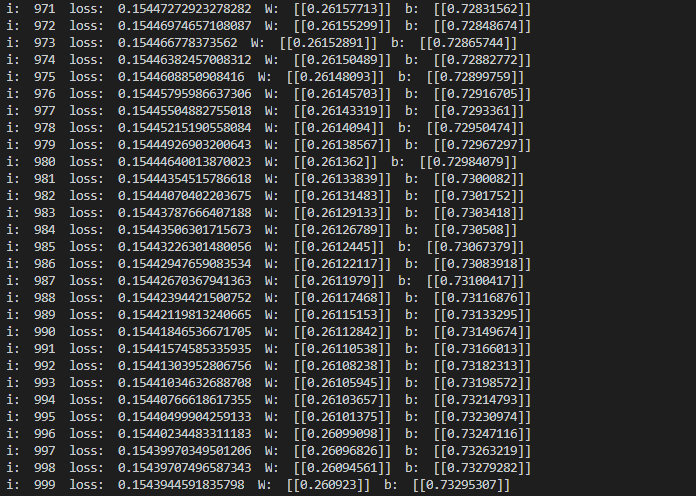
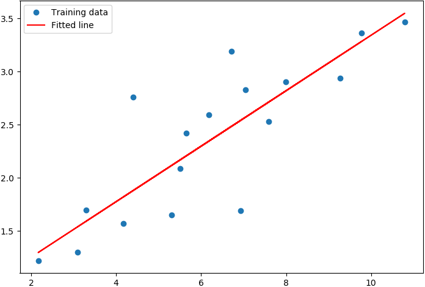

优化算法(梯度下降法)
========================

本章节将讲解VQNet中优化算法的使用，包括经典梯度下降算法和改进后的梯度下降算法，它们都是在求解机器学习算法的模型参数，即无约束优化问题时，最常采用的方法之一。我们在 ``QPanda::Variational`` 中实现了这些算法，``VanillaGradientDescentOptimizer`` 、 ``MomentumOptimizer`` 、 ``AdaGradOptimizer`` 、 ``RMSPropOptimizer`` 和 ``AdamOptimizer``，它们都继承自 ``Optimizer`` 。

接口介绍
----------

我们通过调用梯度下降优化器的 ``minimize`` 接口来生成一个优化器。常见的梯度下降优化器构造方式如下所示，

.. code-block:: cpp

    VanillaGradientDescentOptimizer::minimize(
        loss,   // 损失函数 
        0.01,   // 学习率
        1.e-6); // 结束条件

    MomentumOptimizer::minimize(
        loss,   // 损失函数 
        0.01,   // 学习率
        0.9);   // 动量系数

    AdaGradOptimizer::minimize(
        loss,   // 损失函数 
        0.01,   // 学习率
        0.0,    // 累加量起始值
        1.e-10);// 很小的数值以避免零分母

    RMSOptimizer::minimize(
        loss,   // 损失函数 
        0.01,   // 学习率
        0.9,    // 历史或即将到来的梯度的贴现因子
        1.e-10);// 很小的数值以避免零分母

    AdamOptimizer::minimize(
        loss,   // 损失函数 
        0.01,   // 学习率
        0.9,    // 一阶动量衰减系数
        0.999,  // 二阶动量衰减系数
        1.e-10);// 很小的数值以避免零分母

实例
-------------

示例代码主要演示对离散点用直线进行拟合，我们定义训练数据X和Y，这两个变量表示离散点的坐标。定义两个可微分的变量w和b，其中w表示斜率b表示y轴截距。定义变量Y下划线表示斜率w乘上变量x加上截距。

接着我们定义损失函数loss。计算变量Y和变量Y下划线之间的均方值。

我们调用梯度下降优化器的 ``minimize`` 接口以损失函数，学习率和结束条件作为参数构造生成一个经典梯度下降优化器。

我们通过优化器的 ``get_variables`` 接口可以获得所有可微分的节点。

我们定义迭代次数为1000。然后调用优化器的 ``run`` 接口执行一次优化操作，其第二个参数表示当前的优化次数，目前只有 ``AdamOptimizer`` 这个优化器使用到了这个参数，其它优化器我们直接给0值即可。

我们可以通过优化器 ``get_loss`` 接口获得当前优化后的损失值。我们通过eval接口可以求得可微分变量的当前值。

.. code-block:: cpp

    #include "Variational/Optimizer.h"

    int main()
    {
        using namespace QPanda::Variational;

        MatrixXd train_x(17, 1);
        MatrixXd train_y(17, 1);

        train_x(0, 0) = 3.3;
        train_x(1, 0) = 4.4;
        train_x(2, 0) = 5.5;
        train_x(3, 0) = 6.71;
        train_x(4, 0) = 6.93;
        train_x(5, 0) = 4.168;
        train_x(6, 0) = 9.779;
        train_x(7, 0) = 6.182;
        train_x(8, 0) = 7.59;
        train_x(9, 0) = 2.167;
        train_x(10, 0) = 7.042;
        train_x(11, 0) = 10.791;
        train_x(12, 0) = 5.313;
        train_x(13, 0) = 7.997;
        train_x(14, 0) = 5.654;
        train_x(15, 0) = 9.27;
        train_x(16, 0) = 3.1;
        train_y(0, 0) = 1.7;
        train_y(1, 0) = 2.76;
        train_y(2, 0) = 2.09;
        train_y(3, 0) = 3.19;
        train_y(4, 0) = 1.694;
        train_y(5, 0) = 1.573;
        train_y(6, 0) = 3.366;
        train_y(7, 0) = 2.596;
        train_y(8, 0) = 2.53;
        train_y(9, 0) = 1.221;
        train_y(10, 0) = 2.827;
        train_y(11, 0) = 3.465;
        train_y(12, 0) = 1.65;
        train_y(13, 0) = 2.904;
        train_y(14, 0) = 2.42;
        train_y(15, 0) = 2.94;
        train_y(16, 0) = 1.3;

        var X(train_x);
        var Y(train_y);

        var W(1.0, true);
        var b(1.0, true);

        var Y_ = W * X + b;
        auto loss = sum(poly(Y - Y_, 2) / train_x.rows());
        auto optimizer = VanillaGradientDescentOptimizer::minimize(loss, 0.01, 1.e-6);

        auto leaves = optimizer->get_variables();
        for (size_t i = 0u; i < 1000; i++)
        {
            optimizer->run(leaves);
            std::cout << "i: " << i << "\t" << optimizer->get_loss()
                << "\t W:" << QPanda::Variational::eval(W, true)
                << "\t b:" << QPanda::Variational::eval(b, true)
                << std::endl;
        }

        return 0;
    }

我们将散列点和拟合的直线进行绘图

