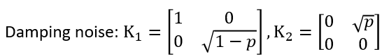
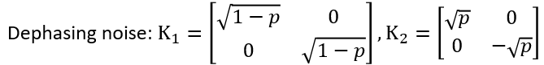
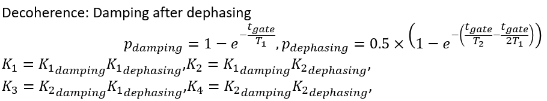

.. _NoiseQVM:

含噪声量子虚拟机
===================

在真实的量子计算机中，受制于量子比特自身的物理特性，常常存在不可避免的计算误差。为了能在量子虚拟机中更好的模拟这种误差，在 :ref:`QuantumMachine` 的基础上，
QPanda2带来了含噪声量子虚拟机。含噪声量子虚拟机的模拟更贴近真实的量子计算机，我们可以自定义支持的逻辑门类型，自定义逻辑门支持的噪声模型，
通过这些自定义形式，我们使用QPanda2开发量子程序的现实应用程度将更高。

接口介绍
------------

含噪声量子虚拟机的接口和其他量子虚拟机的接口大部分是相同的，但含噪声量子虚拟机不能使用PMEASURE系列的概率测量接口。此外QPanda2给它重载了一个init成员函数，
该成员函数可接收一个rapidjson::Document类型的参数，rapidjson::Document保存的是一个Json对象，我们可以在参数中定义含噪声量子虚拟机支持的量子逻辑门类型和
噪声模型，Json的结构如下所示：

     .. code-block:: c

              {
                  “gates”:[.....],
                  "noisemodel":{.....}}              
              }

假设我们希望自定含噪声量子虚拟机支持的逻辑门是RX、RY、CNOT，并且希望设定RX,RY的噪声模型为DECOHERENCE_KRAUS_OPERATOR，那么我们把Json构造成以下形式：

     .. code-block:: c

              {
                  “gates”:[["RX","RY"],["CNOT"]],
                  "noisemodel":{"RX":[DECOHERENCE_KRAUS_OPERATOR,10.0,2.0,0.03],
                                "RY":[DECOHERENCE_KRAUS_OPERATOR,10.0,2.0,0.03]}}              
              }

rapidjson如何使用，我们可以到 `Rapidjson首页 <http://rapidjson.org/zh-cn/>`_ 学习，这里先举个集合QPanda2使用的例子：

     .. code-block:: c
          
          rapidjson::Document doc;
          doc.Parse("{}");
          
          Value value(rapidjson::kObjectType);
          Value value_rx(rapidjson::kArrayType);
          value_rx.PushBack(DECOHERENCE_KRAUS_OPERATOR, doc.GetAllocator());
          value_rx.PushBack(10.0, doc.GetAllocator());
          value_rx.PushBack(2.0, doc.GetAllocator());
          value_rx.PushBack(0.03, doc.GetAllocator());
          value.AddMember("RX", value_rx, doc.GetAllocator());

          Value value_ry(rapidjson::kArrayType);
          value_ry.PushBack(DECOHERENCE_KRAUS_OPERATOR, doc1.GetAllocator());
          value_ry.PushBack(10.0, doc1.GetAllocator());
          value_ry.PushBack(2.0, doc1.GetAllocator());
          value_ry.PushBack(0.03, doc1.GetAllocator());
          value.AddMember("RY", value_ry, doc1.GetAllocator());
          doc.AddMember("noisemodel", value, doc1.GetAllocator());
          NoiseQVM qvm；
          qvm.init(doc);

噪声模型介绍
--------------------------------------

QPanda2的含噪声量子虚拟机为我们提供了丰富的噪声模型，我们可以自定义噪声模型和量子逻辑门的对应关系。噪声模型主要分为两种：单门噪声模型和双门噪声模型。

单门噪声模型
>>>>>>>>>>>>>>

DAMPING_KRAUS_OPERATOR
~~~~~~~~~~~~~~~~~~~~~~~~~

DAMPING_KRAUS_OPERATOR是量子比特的弛豫过程噪声模型，它的kraus算符和表示方法如下图所示：

我们可以看到，DAMPING_KRAUS_OPERATOR需要一个参数P，该参数是double类型的，所以我们在构造Json的时候需要用以下形式（假设设定RX的噪声模型,当然输入的参数也是假定的）：

     .. code-block:: c

              {
                  .....
                  "noisemodel":{"RX":[DAMPING_KRAUS_OPERATOR,3.0],
                                 ......}              
              }

DEPHASING_KRAUS_OPERATOR
~~~~~~~~~~~~~~~~~~~~~~~~~

DEPHASING_KRAUS_OPERATOR是量子比特的退相位过程噪声模型，它的kraus算符和表示方法如下图所示：

我们可以看到，DEPHASING_KRAUS_OPERATOR需要一个参数P，该参数是double类型的，所以我们在构造Json的时候需要用以下形式（假设设定RX的噪声模型）：

     .. code-block:: c

              {
                  .....
                  "noisemodel":{"RX":[DEPHASING_KRAUS_OPERATOR,2.0],
                                 ......}              
              }

DECOHERENCE_KRAUS_OPERATOR
~~~~~~~~~~~~~~~~~~~~~~~~~

DECOHERENCE_KRAUS_OPERATOR是上述两种噪声模型的综合，他们的关系如下图所示：

我们可以看到，DEPHASING_KRAUS_OPERATOR需要三个参数T1，T2，tgate，所有的参数是double类型的，所以我们在构造Json的时候需要用以下形式（假设设定RX的噪声模型）：

     .. code-block:: c

              {
                  .....
                  "noisemodel":{"RX":[DECOHERENCE_KRAUS_OPERATOR,10.0,2.0,0.03],
                                 ......}              
              }

双门噪声模型
>>>>>>>>>>>>>>

双门噪声模型同样也分为三种：DOUBLE_DAMPING_KRAUS_OPERATOR、DOUBLE_DEPHASING_KRAUS_OPERATOR、DOUBLE_DECOHERENCE_KRAUS_OPERATOR。
它们的输入参数与单门噪声模型一致，双门噪声模型的kraus算符和表示与单门噪声模型存在着对应关系：假设单门噪声模型为： :math:`\{ K1, K2 \}` ，那么对应的双门噪声模型为
:math:`\{K1\otimes K1, K1\otimes K2, K2\otimes K1, K2\otimes K2\}`。

