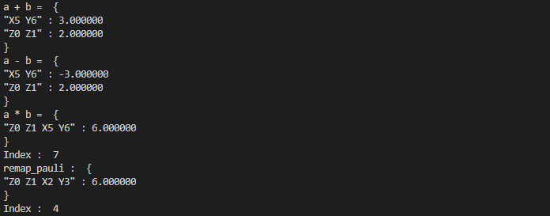

运算符
===========

泡利运算符(PauliOperator)
^^^^^^^^^^^^^^^^^^^^^^^^^^^^^^

量子运算符可以表示为Pauli运算符I，X，Y，Z的组合。``PauliOperator`` 类除了提供Pauli运算符之间加、减和乘的基础的运算操作，
还提供了诸如求共轭、打印和判空等常用操作。

在QPanda中我们实现了该组件，使用该组件必须包含QPanda命名空间 ``QPanda::PauliOperator``，详见 ``PauliOperator.h`` 。 

接口介绍
`````````````````

.. cpp:class:: PauliOperator

   .. cpp:function:: PauliOperator()

        **功能**
            构造函数。创建一个空的Pauli运算符。
        **参数**
            无

   .. cpp:function:: PauliOperator(const complex_d &value)

        **功能**
            构造函数。通过传入 ``complex_d`` 类型数据来构造Fermion运算符I的系数。
        **参数**
            - value 系数值

   .. cpp:function:: PauliOperator(double value)
      
        **功能** 
            构造函数。通过传入double类型数据来构造pauli运算符I的系数。
        **参数**
            - value 系数值

   .. cpp:function:: PauliOperator(const std::string &key, const complex_d &value)
      
        **功能**
            构造函数。构造指定Pauli算符及其系数。
        **参数**
            - key 字符串类型的Pauli算符
            - value 系数值

   .. cpp:function:: PauliOperator(const PauliMap &map)
      
        **功能** 
            构造函数。通过传入 ``PauliMap`` 类型数据来构造pauli运算符。
        **参数**
            - map 一组Pauli算符及其系数

   .. cpp:function:: PauliOperator dagger()
      
        **功能** 
            求该Pauli运算符的共轭Pauli运算符。
        **参数**
            无
        **返回值**
            Pauli运算符

   .. cpp:function:: PauliOperator remapQubitIndex(std::map<size_t, size_t> &index_map)
      
        **功能**  
            对该Pauli运算符中索引从0开始分配映射。例如该运算符只含有"Z1 Z20"，重新映射得到"Z0 Z1"。 
        **参数**
            - index_map 用于存放新的映射关系
        **返回值**
            Pauli运算符

   .. cpp:function:: size_t getMaxIndex()
      
        **功能** 
            获得该Pauli运算符使用的索引值数。如果为空则返回0，否则返回最大下标索引值+1的结果。例如"Z0 Z5",返回的数值是6。
        **参数**
            无
        **返回值**
            Pauli运算符使用的索引值。

   .. cpp:function:: bool isEmpty()
      
        **功能**
            测试该Pauli运算符是否为空。
        **参数**
            无
        **返回值**
            如果为空返回true，否则返回false。

   .. cpp:function:: bool isAllPauliZorI()
      
        **功能**
            测试该Pauli运算符是否全为"Z"或"I"。
        **参数**
            无
        **返回值**
            如果是返回true，否则返回false。

   .. cpp:function:: void setErrorThreshold(double threshold)
      
        **功能**
            设置误差阈值，如果小于该误差阈值则认为其系数为0，不参与打印输出及计算。
        **参数**
            - threshold 阈值
        **返回值**
            无

   .. cpp:function:: std::string toString()
      
        **功能**  
            返回Pauli运算符的string表达式。
        **参数**
            无
        **返回值**
            Pauli运算符的string表达式。

   .. cpp:function:: QHamiltonian toHamiltonian(bool *ok = nullptr)
      
        **功能** 
            返回Pauli运算符的哈密顿量表达式。
        **参数**
            - ok 如果该Pauli运算符是哈密顿量这设置为true，否则为false
        **返回值**
            哈密顿量表达式。

   .. cpp:function:: PauliData data()
      
        **功能**
            返回Pauli运算符的数据。
        **参数**
            无
        **返回值**
            Pauli运算符的数据。

实例
>>>>>>>>>>>

.. code-block:: cpp
    
    #include "Operator/PauliOperator.h"

    int main()
    {
        QPanda::PauliOperator a("Z0 Z1", 2);
        QPanda::PauliOperator b("X5 Y6", 3);

        auto plus = a + b;
        auto minus = a - b;
        auto muliply = a * b;

        std::cout << "a + b = " << plus << std::endl << std::endl;
        std::cout << "a - b = " << minus << std::endl << std::endl;
        std::cout << "a * b = " << muliply << std::endl << std::endl;

        std::cout << "Index : " << muliply.getMaxIndex() << std::endl << std::endl;

        std::map<size_t, size_t> index_map;
        auto remap_pauli = muliply.remapQubitIndex(index_map);

        std::cout << "remap_pauli : " << remap_pauli << std::endl << std::endl;
        std::cout << "Index : " << remap_pauli.getMaxIndex() << std::endl;

        return 0;
    }




费米子运算符(FermionOperator)
^^^^^^^^^^^^^^^^^^^^^^^^^^^^^^^^^^^

跟 ``PauliOperator`` 类似，``FermionOperator`` 类也提供了Fermion运算符之间加、减和乘的基础的运算操作。通过整理功能可以得到一份有序排列的运算符。

接口介绍
`````````````````````````

.. cpp:class:: FermionOperator

   .. cpp:function:: FermionOperator()

        **功能**
            构造函数。创建一个空的Pauli运算符。
        **参数**
            无

   .. cpp:function:: PauliOperator(const complex_d &value)

        **功能**
            构造函数。通过传入 ``complex_d`` 类型数据来构造Fermion运算符I的系数。
        **参数**
            - value 系数值

   .. cpp:function:: FermionOperator(double value)
      
        **功能**
            构造函数。通过传入double类型数据来构造Fermion运算符I的系数。
        **参数**
            - value 系数值

   .. cpp:function:: FermionOperator(const std::string &key, const complex_d &value)

        **功能** 
            构造函数。构造指定Fermion算符及其系数。
        **参数**
            - key 字符串类型的Fermion算符
            - value 系数值

   .. cpp:function:: FermionOperator(const FermionMap &map)
      
        **功能**
            构造函数。通过传入 ``FermionMap`` 类型数据来构造Fermion运算符。
        **参数**
            - map Fermion算符及其系数的映射

   .. cpp:function:: FermionOperator normal_ordered()
      
        **功能**
            对该Fermion运算符进行整理。在这个转换中我们规定张量因子从高到低进行排序，并且创建（ :math:`a_x` ）出现在湮没（ :math:`a_x^\dagger` ）之前。
        **参数**
            无
        **返回值**
            Fermion运算符

   .. cpp:function:: void setAction(char create, char annihilation)
      
        **功能**
            设置标识符，默认创建标识符为"+"，湮没标识符为""。
        **参数**
            - create 创建标识符
            - annihilation 湮没标识符
        **返回值**
            Pauli运算符

   .. cpp:function:: bool isEmpty()
      
        **功能**
            测试该Pauli运算符是否为空。
        **参数**
            无
        **返回值**
            如果为空返回true，否则返回false。

   .. cpp:function:: void setErrorThreshold(double threshold)
      
        **功能**
            设置误差阈值，如果小于该误差阈值则认为其系数为0，不参与打印输出及计算。
        **参数**
            - threshold 阈值
        **返回值**
            无

   .. cpp:function:: std::string toString()
      
        **功能**
            返回Pauli运算符的string表达式。
        **参数**
            无
        **返回值**
            Pauli运算符的string表达式。

   .. cpp:function:: FermionData data()
      
        **功能**
            返回Fermion运算符的数据。
        **参数**
            无
        **返回值**
            Fermion运算符的数据。

.. note::
    湮没: x 表示 :math:`a_x` ;
    创建: x+ 表示 :math:`a_x^\dagger` 。
    例如 "1+ 3 5+ 1"则代表 :math:`a_1^\dagger \ a_3 \ a_5^\dagger \ a_1`

实例

.. code-block:: cpp

    #include "Operator/FermionOperator.h"

    int main()
    {
        QPanda::FermionOperator a("0 1+", 2);
        QPanda::FermionOperator b("2+ 3", 3);

        auto plus = a + b;
        auto minus = a - b;
        auto muliply = a * b;

        std::cout << "a + b = " << plus << std::endl << std::endl;
        std::cout << "a - b = " << minus << std::endl << std::endl;
        std::cout << "a * b = " << muliply << std::endl << std::endl;

        std::cout << "normal_ordered(a + b) = " << plus.normal_ordered() << std::endl << std::endl;
        std::cout << "normal_ordered(a - b) = " << minus.normal_ordered() << std::endl << std::endl;
        std::cout << "normal_ordered(a * b) = " << muliply.normal_ordered() << std::endl << std::endl;

        return 0;
    }

.. image:: images/FermionOperatorTest.png   