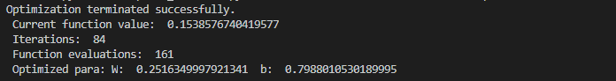
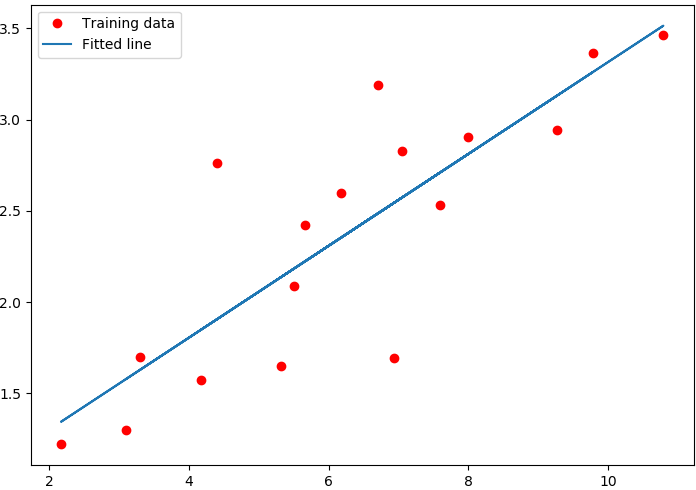

优化算法(直接搜索法)
=======================

本章节将讲解优化算法的使用，包括 ``Nelder-Mead`` 算法跟 ``Powell`` 算法，它们都是一种直接搜索算法。我们在 ``QPanda`` 中实现了这两个算法，``OriginNelderMead`` 和 ``OriginPowell`` ，
这两个类都继承自 ``AbstractOptimizer`` 。

接口介绍
--------------

我们可以通过优化器工厂生成指定类型的优化器，例如我们指定它的类型为Nelder-Mead

.. code-block:: cpp

    using namespace QPanda; 
    auto optimizer = OptimizerFactory::makeOptimizer(NELDER_MEAD);  

我们需要向优化器注册一个计算损失值的函数和待优化参数。

.. code-block:: cpp

    vector_d init_para{0, 0}; 
    optimizer->registerFunc(myFunc, init_para); 
  

然后设置结束条件，我们可以设置变量及函数值的收敛阈值，函数最大可调用次数，和优化迭代次数。只要满足上述结束条件，则优化结束。

.. code-block:: cpp
    
    optimizer->setXatol(1e-6); 
    optimizer->setFatol(1e-6); 
    optimizer->setMaxFCalls(200); 
    optimizer->setMaxIter(200); 

然后通过exec接口执行优化，通过getResult接口获得优化后的结果。

.. code-block:: cpp

    optimizer->exec(); 
    auto result = optimizer->getResult();

实例
--------------

给定一些散列点，我们来拟合一条直线，使得散列点到直线的距离和最小。定义直线的函数的表达式为 ``y = w*x + b`` ，接下来我们将通过使用优化算法得到w和b的优化值。 首先定义求期望的函数

.. code-block:: cpp

    QPanda::QResultPair myFunc(QPanda::vector_d para)
    {
        std::vector<double> x = {3.3, 4.4, 5.5, 6.71, 6.93, 4.168, 9.779, 6.182, 7.59,
                    2.167, 7.042, 10.791, 5.313, 7.997, 5.654, 9.27, 3.1};

        std::vector<double> y = {1.7, 2.76, 2.09, 3.19, 1.694, 1.573, 3.366, 2.596, 2.53,
                    1.221, 2.827, 3.465, 1.65, 2.904, 2.42, 2.94, 1.3};

        std::vector<double> y_;

        for (auto i = 0u; i < x.size(); i++)
        {
            y_.push_back(para[0]*x[i] + para[1]);
        }

        float loss = 0;
        for (auto i = 0u; i < y.size(); i++)
        {
            loss += std::pow(y[i] - y_[i], 2)/y.size();
        }

        return std::make_pair("", loss);
    }

我们使用 ``Nelder-Mead`` 算法进行优化

.. code-block:: cpp

    #include "Optimizer/AbstractOptimizer.h"
    #include "Optimizer/OptimizerFactory.h"
    #include <iostream>

    int main()
    {
        auto optimizer = QPanda::OptimizerFactory::makeOptimizer(QPanda::OptimizerType::NELDER_MEAD);

        QPanda::vector_d init_para{0, 0};
        optimizer->registerFunc(myFunc, init_para);
        optimizer->setXatol(1e-6);
        optimizer->setFatol(1e-6);
        optimizer->setMaxFCalls(200);
        optimizer->setMaxIter(200);
        optimizer->exec();

        auto result = optimizer->getResult();

        std::cout << result.message << std::endl;
        std::cout << "         Current function value: "
            << result.fun_val << std::endl;
        std::cout << "         Iterations: "
            << result.iters << std::endl;
        std::cout << "         Function evaluations: "
            << result.fcalls << std::endl;

        std::cout << "         Optimized para: " << std::endl;
        for (auto i = 0u; i < result.para.size(); i++)
        {
            std::cout << "             " << result.para[i] << std::endl;
        }
    }

我们将散列点和拟合的直线进行绘图

