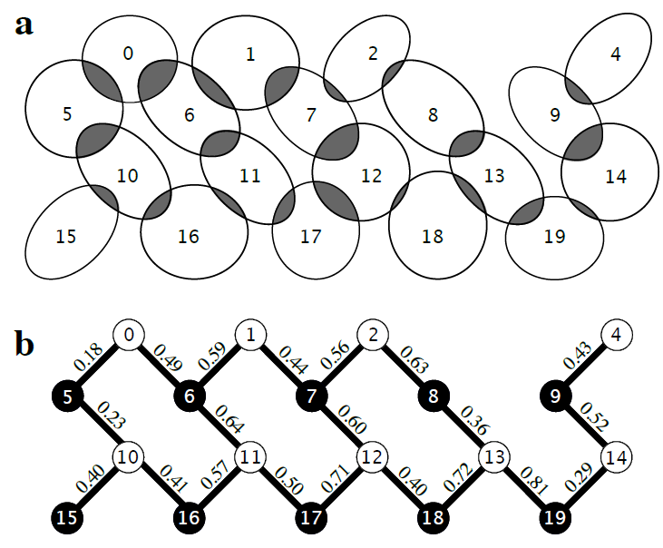
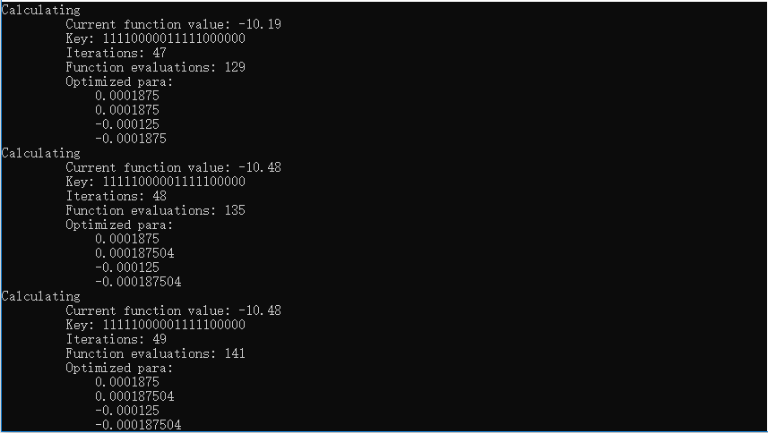

量子近似优化算法(QAOA)
=========================

量子近似优化算法(Quantum Approximate Optimization Algorithm, QAOA)，是由Farhi, Goldstone和Gutmann开发的，是用于*寻找最优化问题的一种好的解决方案*的一个多项式时间算法[`1 <https://arxiv.org/abs/1602.07674>`_, `2 <https://arxiv.org/abs/1411.4028>`_]

这个名字是什么意思呢？对于给定的NP-Hard问题，近似算法是一种多项式时间算法，该算法以期望的一些质量保证来解决每个问题实例。品质因数是多项式时间解的质量与真实解的质量之间的比率。
QAOA很有意思的一个原因是它具有展示量子优势(Quantum Advantage)的潜力 [`1 <https://arxiv.org/abs/1602.07674>`_] 。

接口介绍
--------------

在QPanda中我们实现了上述算法，使用该算法必须包含QPanda命名空间 ``QPanda::QAOA``，详见 ``QAOA.h`` 。 

.. cpp:class:: QAOA

   .. cpp:function:: QAOA(OptimizerType optimizer = OptimizerType::NELDER_MEAD)

        **功能**
            构造函数。通过传入指定的优化器类型来进行构造，默认使用的优化器是 ``Nelder-Mead``
        **参数**
            - optimizer 优化器类型

   .. cpp:function:: QAOA(const std::string &optimizer)
      
        **功能**
            构造函数。通过传入string类型的优化器来进行构造。
        **参数**
            - optimizer 优化器类型

   .. cpp:function:: void setHamiltonian(const QPauliMap &pauli_map)
      
        **功能**
            设置问题的哈密顿量，将问题转换成 ``QPauliMap`` 的形式进行输入。
        **参数**
            - puauli_map 问题的哈密顿量
        **返回值**
            无

   .. cpp:function:: void setDeltaT(double delta_t)
      
        **功能**
            设置要优化的参数，这个参数决定量子线路的构造。
        **参数**
            - delta_t 优化参数
        **返回值**
            无

   .. cpp:function:: void setStep(size_t step)
      
        **功能**
            设置参考哈密顿量和MAXCUT哈密顿量之间演化的近似步长。
        **参数**
            - step 步长
        **返回值**
            无

   .. cpp:function:: void setShort(size_t shots)

        **功能**      
            设置测量次数。
        **参数**
            - shots 测量次数
        **返回值**
            无

   .. cpp:function:: void regiestUserDefinedFunc(const QUserDefinedFunc &func)
      
        **功能**
            注册用户自定义求期望的函数。
        **参数**
            - func 用户自定义函数
        **返回值**
            无

   .. cpp:function:: void setDefaultOptimizePara(const vector_d &para)
      
        **功能**
            设置默认优化参数。
        **参数**
            - para 默认优化参数
        **返回值**
            无

   .. cpp:function:: bool exec()
      
        **功能**
            执行算法。
        **参数**
            无
        **返回值**
            返回true表示QAOA成功执行，否则执行失败。

   .. cpp:function:: QOptimizationResult getOptimizerResult()
      
        **功能**
            获取优化后的参数值。
        **参数**
            无
        **返回值**
            优化后的结果。

   .. cpp:function:: AbstractOptimizer* getOptimizer()
      
        **功能**
            获取优化器实例，通过该实例修改优化器的参数。
        **参数**
            无
        **返回值**
            优化器实例指针。

实例
-------------

我们将结合一个简单的例子，来演示一下如何使用该算法接口。问题如下图所示：

首先构建该问题的哈密顿量

.. code-block:: cpp

    QPanda::QPauliMap initHamiltonian()
    {
        QPanda::QPauliMap pauli_map;
        pauli_map.insert(std::make_pair("Z0 Z6", 0.49));
        pauli_map.insert(std::make_pair("Z6 Z1", 0.59));
        pauli_map.insert(std::make_pair("Z1 Z7", 0.44));
        pauli_map.insert(std::make_pair("Z7 Z2", 0.36));

        pauli_map.insert(std::make_pair("Z2 Z8", 0.63));
        pauli_map.insert(std::make_pair("Z8 Z13", 0.36));
        pauli_map.insert(std::make_pair("Z13 Z19", 0.81));
        pauli_map.insert(std::make_pair("Z19 Z14", 0.29));

        pauli_map.insert(std::make_pair("Z14 Z9", 0.52));
        pauli_map.insert(std::make_pair("Z9 Z4", 0.43));
        pauli_map.insert(std::make_pair("Z13 Z18", 0.72));
        pauli_map.insert(std::make_pair("Z18 Z12", 0.40));

        pauli_map.insert(std::make_pair("Z12 Z7", 0.60));
        pauli_map.insert(std::make_pair("Z12 Z17", 0.71));
        pauli_map.insert(std::make_pair("Z17 Z11", 0.50));
        pauli_map.insert(std::make_pair("Z11 Z6", 0.64));

        pauli_map.insert(std::make_pair("Z11 Z16", 0.57));
        pauli_map.insert(std::make_pair("Z16 Z10", 0.41));
        pauli_map.insert(std::make_pair("Z10 Z5", 0.23));
        pauli_map.insert(std::make_pair("Z10 Z15", 0.40));

        pauli_map.insert(std::make_pair("Z5 Z0", 0.18));

        return pauli_map;
    }

接下来定义求解该问题期望的方法

.. code-block:: cpp

    double myFunc(const std::string &key, const QPanda::QPauliMap &pauli_map)
    {
        double sum = 0;

        QPanda::PauliOperator pauli_op(pauli_map);
        QPanda::QHamiltonian hamiltonian = pauli_op.toHamiltonian();

        for_each(hamiltonian.begin(),
            hamiltonian.end(),
            [&](const QPanda::QHamiltonianItem &item)
        {
            std::vector<size_t> index_vec;
            for (auto iter = item.first.begin();
                iter != item.first.end();
                iter++)
            {
                index_vec.push_back(iter->first);
            }

            size_t i = index_vec.front();
            size_t j = index_vec.back();
            if (key[i] != key[j])
            {
                sum += item.second;
            }
        });

        return sum;
    }

调用QAOA接口求解该问题的解

.. code-block:: cpp

    #include "QAOA/QAOA.h"
    #include "Operator/PauliOperator.h"
    #include "Optimizer/AbstractOptimizer.h"

    int main()
    {
        QPanda::vector_d optimize_para_vec(4, 0);
        QPanda::QAOA qaoa;

        QPanda::QPauliMap pauli_map = initHamiltonian();
        qaoa.setHamiltonian(pauli_map);
        qaoa.setShots(1000);
        qaoa.setStep(2);
        qaoa.regiestUserDefinedFunc(std::bind(&myFunc,
            std::placeholders::_1,
            pauli_map));

        QPanda::AbstractOptimizer* optimizer = qaoa.getOptimizer();
        optimizer->setMaxFCalls(1000);
        optimizer->setMaxIter(1000);
        optimizer->setDisp(true);

        qaoa.exec();

        return 0;
    }

运行结果如下所示

