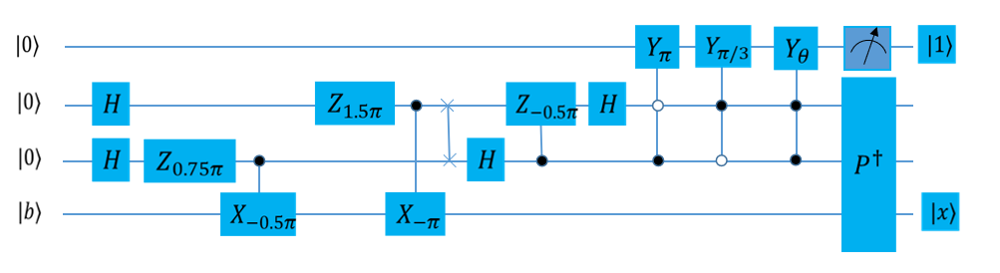

量子线路
====================
----

量子线路，也称量子逻辑电路是最常用的通用量子计算模型，表示在抽象概念下，对于量子比特进行操作的线路。组成包括了量子比特、线路（时间线），以及各种逻辑门。最后常需要量子测量将结果读取出来。

不同于传统电路是用金属线所连接以传递电压讯号或电流讯号，在量子线路中，线路是由时间所连接，亦即量子比特的状态随着时间自然演化，过程中是按照哈密顿运算符的指示，一直到遇上逻辑门而被操作。

由于组成量子线路的每一个量子逻辑门都是一个 ``酉算子`` ，所以整个量子线路整体也是一个大的酉算子。

量子算法线路图
>>>>>>>>>>>>>>>>>>>>>
----

在目前的量子计算理论研究中，各种量子算法常用量子线路表示，比如下方列出的量子算法中的 ``HHL算法`` 量子线路图。

.. _api_introduction:

接口介绍
>>>>>>>>>>>>>>>>>>>>>>>>>>>>
----

在QPanda2中，QCircuit类是一个仅装载量子逻辑门的容器类型，它也是QNode中的一种，初始化一个QCircuit对象有以下两种

C++风格

    .. code-block:: c

        QCircuit cir = QCircuit();

C语言风格

    .. code-block:: c

        QCircuit cir = CreateEmptyCircuit();

你可以通过如下方式向QCircuit尾部填充节点

        .. code-block:: c

            QCircuit << QNode;

或者
        
        .. code-block:: c

            QCircuit.pushBackNode(QNode);

QNode的类型有QGate，QPorg，QIf，Measure等等，但是对于QCircuit而言，仅能插入QGate类型和QCircuit。所以QCircuit类是一个QGate对象和另一些QCircuit对象的集合。

同时，你也可以对目标线路施加装置共轭和受控操作，QCircuit类型有两个成员函数可以做转置共轭操作：
dagger、setDagger。

setDagger的作用是根据输入参数更新当前量子线路的dagger标记，在计算时计算后端会根据dagger判断当前量子逻辑门是否需要执行转置共轭操作。举个例子：

        .. code-block:: c
            
            QCircuit cir;
            cir.setDagger(true);

该函数需要一个布尔类型参数，用来设置当前逻辑门是否需要转置共轭操作。

dagger的作用是复制一份当前的量子线路，并更新复制的量子线路的dagger标记。举个例子：

        .. code-block:: c
            
            QCircuit cir;
            QCircuit cir_dagger = cir.dagger();

除了转置共轭操作，您也可以为量子线路添加控制比特.QCircuit类型有两个成员函数用于添加控制比特：control、setControl。

setControl的作用是给当前的量子线路添加控制比特，例如：

        .. code-block:: c
            
            QCircuit cir;
            cir.setControl(qvec);

control的作用是复制当前的量子线路，并给复制的量子线路添加控制比特，例如：

        .. code-block:: c
            
                QCircuit cir;
                QCircuit cir_control = cir.control(qvec);

上述都需要接收一个参数，参数类型为QVec，QVec是qubit的vector容器类型。

    .. note:: 
        - 向QCircuit中插入QPorg，QIf，Measure中不会报错，但是运行过程中可能会产生预料之外的错误
        - 一个构建好的QCircuit不能直接参与量子计算与模拟，需要进一步构建成QProg类型

        __ ./QCircuit.html#api-introduction

        __ ./QGate.html#api-introduction

实例
>>>>>>>>>>>
----

    .. code-block:: c
    
        #include "QPanda.h"
        USING_QPANDA

        int main(void)
        {
            init();
            auto qvec = qAllocMany(4);
            auto cbits = cAllocMany(4);
            auto circuit = CreateEmptyCircuit(); // 与 QCircuit circuit 功能相同

            circuit << H(qvec[0]) << CNOT(qvec[0], qvec[1])
                    << CNOT(qvec[1], qvec[2]) << CNOT(qvec[2], qvec[3]);
            circuit.setDagger(true);
            auto prog = CreateEmptyQProg();
            prog << H(qvec[3]) << circuit << Measure(qvec[0], cbits[0]);

            auto result = runWithConfiguration(prog, cbits, 1000);
            for (auto &val : result)
            {
                std::cout << val.first << ", " << val.second << std::endl;
            }

            finalize();
            return 0;
        }

运行结果：

    .. code-block:: c

        0000, 510
        1000, 490

