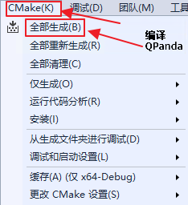
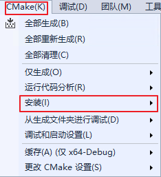
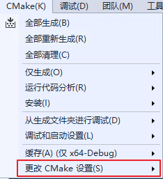
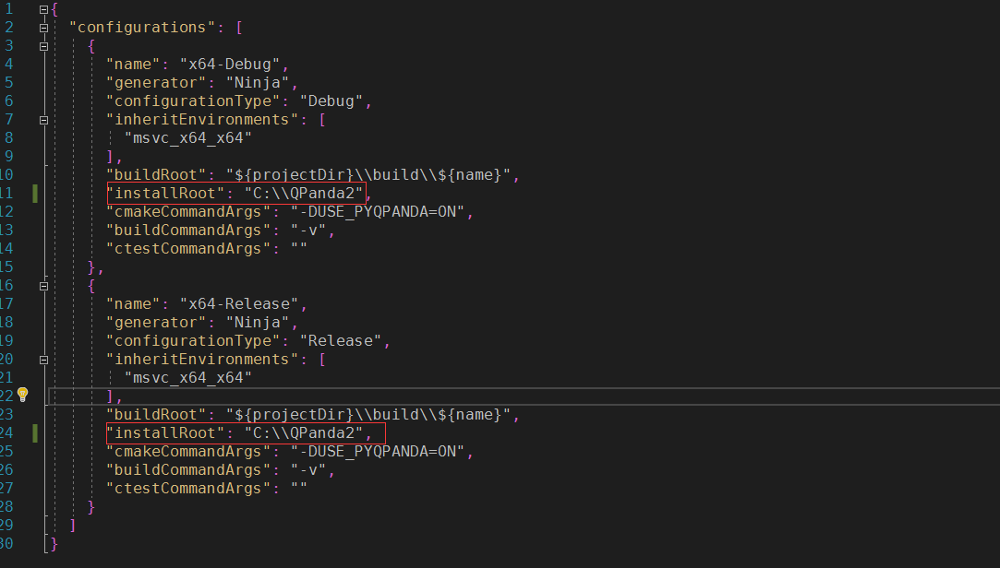

编译、安装和使用
==================


编译
------------------
我们支持在Windows、Linux、MacOS下构建QPanda-2。用户可以通过CMake的方式来构建QPanda-2。

Windows
***************
在Windows构建QPanda-2。用户首先需要保证在当前主机下安装了CMake环境和C++编译环境，用户可以通过Visual Studio和MinGW方式编译QPanda-2。

1. 使用Visual Studio
***************************
使用Visual Studio编译QPanda-2,只需要安装Visual Studio，并需要在组件中安装CMake组件。安装完成之后，用Visual Studio打开QPanda-2文件夹，即可使用CMake编译QPanda-2。




2. 使用MinGW
********************

使用MinGW编译QPanda-2，需要自行搭建CMake和MinGW环境，用户可自行在网上查询环境搭建教程。（注意： MinGW需要安装64位版本）

CMake+MinGW的编译命令如下：

1. 在QPanda-2根目录下创建build文件夹
2. 进入build文件夹，打开cmd
3. 由于MinGW对CUDA的支持存在一些问题，所以在编译时需要禁掉CUDA，输入以下命令：

.. code-block:: c

    cmake -G"MinGW Makefiles" -DFIND_CUDA=OFF -DCMAKE_INSTALL_PREFIX=C:/QPanda ..
    mingw32-make

Linux 和MacOS
******************

在Linux和MacOS下编译QPanda-2，命令是一样的。

编译步骤如下：

1. 进入QPanda-2根目录
2. 输入以下命令：

.. code-block:: c

    mkdir -p build
    cd build
    cmake ..
    make

如果有需求，用户通过命令修改QPanda-2的安装路径，配置方法如下所示：

.. code-block:: c

    mkdir -p build
    cd build
    cmake -DCMAKE_INSTALL_PREFIX=/usr/local ..
    make


安装
------------------

Windows
***************

1. 使用Visual Studio
***************************
在QPanda-2编译完成后，用户可以安装QPanda-2，Visual Studio的安装方式很简单，只需要在Cmake菜单中选择安装即可。




QPanda-2会安装在用户在CMakeSettings.json中配置的安装目录下。安装成功后会在用户配置的的目录下生成install文件夹，里面安装生成include和lib文件。如果有需求，用户可以在Visual Studio的CMakeSettings.json配置文件修改QPanda-2的安装路径。生成CMakeSettings.json的方法如下图所示：



修改QPanda-2的安装路径如下图所示：




参数修改完成后，cmake选项下执行安装，Qpanda-2的lib库文件和include头文件会安装到用户指定的安装位置。(注意：需先进行编译成功后才能进行安装)

2. 使用MinGW
********************

在QPanda-2编译完成后，用户可以安装QPanda-2，安装命令如下：

.. code-block:: c

    mingw32-make install

Linux 和MacOS
******************

在Linux和MacOS下安装命令QPanda-2，命令是一样的，安装命令如下：

.. code-block:: c

    sudo make install

使用
------------------

不同的平台和不同的IDE在构建C++项目是的方法是不一样的，调用库的方式也不尽相同， cmake是一种跨平台和跨IDE的项目管理工具，下面就以cmake构建项目为例演示使用QPanda2库进行量子编程。

VS下使用QPanda2
***********************************

编写CMakeList
```````````````````````````````````

VS下使用QPanda2的CMakeList的写法为

    .. code-block:: c

        cmake_minimum_required(VERSION 3.1)
        project(testQPanda)
        SET(CMAKE_INSTALL_PREFIX  "C:/QPanda2") # QPanda2安装的路径
        SET(CMAKE_MODULE_PATH ${CMAKE_MODULE_PATH} "${CMAKE_INSTALL_PREFIX}/lib/cmake")

        set(CMAKE_CXX_STANDARD 14)
        set(CMAKE_CXX_STANDARD_REQUIRED ON)
        if (NOT USE_MSVC_RUNTIME_LIBRARY_DLL)
            foreach (flag
                CMAKE_C_FLAGS
                CMAKE_C_FLAGS_DEBUG
                CMAKE_C_FLAGS_RELEASE
                CMAKE_C_FLAGS_MINSIZEREL
                CMAKE_C_FLAGS_RELWITHDEBINFO
                CMAKE_CXX_FLAGS
                CMAKE_CXX_FLAGS_DEBUG
                CMAKE_CXX_FLAGS_RELEASE
                CMAKE_CXX_FLAGS_MINSIZEREL
                CMAKE_CXX_FLAGS_RELWITHDEBINFO)

                if (${flag} MATCHES "/MD")
                    string(REGEX REPLACE "/MD" "/MT" ${flag} "${${flag}}")
                endif()
                if (${flag} MATCHES "/MDd")
                    string(REGEX REPLACE "/MDd" "/MTd" ${flag} "${${flag}}")
                endif()
                if (${flag} MATCHES "/W3")
                    string(REGEX REPLACE "/W3" "/W0" ${flag} "${${flag}}")
                endif()
            endforeach()
        endif()

        set(LIBRARY_OUTPUT_PATH ${PROJECT_BINARY_DIR}/lib)
        set(EXECUTABLE_OUTPUT_PATH ${PROJECT_BINARY_DIR}/bin)

        find_package(OpenMP)
        if(OPENMP_FOUND)
            option(USE_OPENMP "find OpenMP" ON)
            message("OPENMP FOUND")
            set(CMAKE_C_FLAGS "${CMAKE_C_FLAGS} ${OpenMP_C_FLAGS}")
            set(CMAKE_CXX_FLAGS "${CMAKE_CXX_FLAGS} ${OpenMP_CXX_FLAGS}")
            set(CMAKE_EXE_LINKER_FLAGS "${CMAKE_EXE_LINKER_FLAGS} ${OpenMP_EXE_LINKER_FLAGS}")
        else(OPENMP_FOUND)
            option(USE_OPENMP "not find OpenMP" OFF)
        endif(OPENMP_FOUND)

        find_package(QPANDA REQUIRED)
        if (QPANDA_FOUND)
            include_directories(${QPANDA_INCLUDE_DIR}) 
        endif (QPANDA_FOUND)

        add_executable(${PROJECT_NAME} test.cpp)
        target_link_libraries(${PROJECT_NAME} ${QPANDA_LIBRARIES})

 linux、MacOS及MinGW下使用QPanda2
 ************************************************

linux、MacOS和MinGW下使用QPanda2的方式是相同的，其CmakeList的写法为：

    .. code-block:: c

        add_definitions("-w -DGTEST_USE_OWN_TR1_TUPLE=1")
        set(CMAKE_BUILD_TYPE "Release")
        set(CMAKE_CXX_FLAGS_DEBUG "$ENV{CXXFLAGS} -O0 -g -ggdb")
        set(CMAKE_CXX_FLAGS_RELEASE "$ENV{CXXFLAGS} -O3")
        add_compile_options(-fpermissive)

        set(LIBRARY_OUTPUT_PATH ${PROJECT_BINARY_DIR}/lib)
        set(EXECUTABLE_OUTPUT_PATH ${PROJECT_BINARY_DIR}/bin)

        find_package(OpenMP)
        if(OPENMP_FOUND)
            option(USE_OPENMP "find OpenMP" ON)
            message("OPENMP FOUND")
            set(CMAKE_C_FLAGS "${CMAKE_C_FLAGS} ${OpenMP_C_FLAGS}")
            set(CMAKE_CXX_FLAGS "${CMAKE_CXX_FLAGS} ${OpenMP_CXX_FLAGS}")
            set(CMAKE_EXE_LINKER_FLAGS "${CMAKE_EXE_LINKER_FLAGS} ${OpenMP_EXE_LINKER_FLAGS}")
        else(OPENMP_FOUND)
            option(USE_OPENMP "not find OpenMP" OFF)
        endif(OPENMP_FOUND)

        find_package(QPANDA REQUIRED)
        if (QPANDA_FOUND)
            include_directories(${QPANDA_INCLUDE_DIR}) 
        endif (QPANDA_FOUND)

        add_executable(${PROJECT_NAME} test.cpp)
        target_link_libraries(${PROJECT_NAME} ${QPANDA_LIBRARIES})

.. note:: ``test.cpp`` 为使用QPanda2的一个示例。有兴趣的可以试着将其合并在一起形成一个跨平台的CMakeList。

编译方式与编译QPanda库的方式基本类似，在这里就不多做赘述。

编译之后的可执行文件会生成在build下的bin文件夹中，进入到bin目录下就可以执行自己编写的量子程序了。


