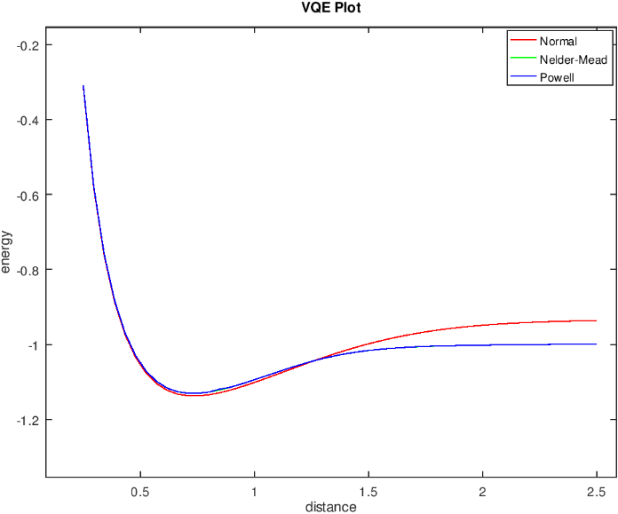

变分量子特征求解算法(VQE)
============================

变分量子特征值求解算法(Variational-Quantum-Eigensolver，简称VQE)[`1 <https://arxiv.org/abs/1304.3061>`_,
`2 <https://arxiv.org/abs/1509.04279>`_]是用于找到一个矩阵 :math:`H` （通常是一个较大矩阵）的特征值的量子与经典混合的算法。
当这个算法用在量子模拟时，:math:`H`  就是某系统的Hamiltonian [`3 <https://arxiv.org/abs/1512.06860>`_, `4 <https://arxiv.org/abs/1602.01857>`_,
`5 <https://arxiv.org/abs/1510.03859>`_]。在这个混合算法中，量子子程序是在经典优化回路内部运行。

这里的量子子程序有两个基本的步骤：

（1）制备量子态 :math:`|\Psi(\vec{\theta})\rangle` 。

（2）测量期望值 :math:`\langle\,\Psi(\vec{\theta})\,|\,H\,|\,\Psi(\vec{\theta})\,\rangle` 。

由 `变分原则 <https://en.wikipedia.org/wiki/Variational_method_(quantum_mechanics)>`_ 可知，这个期望值不小于 :math:`H` 的最小特征值。
这个限定使得我们能够运用优化回路（optimization loop）的经典计算方法来找特征值：

（1）运用经典的非线性优化器通过改变参数 来最小化期望值  :math:`\vec{\theta}` 。

（2）不断迭代，直到收敛。

事实上，VQE的量子子程序等价于基于参数  :math:`\vec{\theta}` 的集合来制备一个状态，并在适当的基上进行一系列的测量。在这个算法中参数化的状态的制备是比较困难的，并且参数化状态的制备显著地影响到算法的工作性能。

接口介绍
--------------

在QPanda中我们实现了上述算法，使用该算法必须包含QPanda命名空间 ``QPanda::VQE``，详见 ``VQE.h`` 。 

.. cpp:class:: VQE

   .. cpp:function:: VQE(OptimizerType optimizer = OptimizerType::Powell)

        **功能**
            构造函数。通过传入指定的优化器类型来进行构造，默认使用的优化器是 ``Powell``
        **参数**
            - optimizer 优化器类型

   .. cpp:function:: VQE(const std::string &optimizer)
      
        **功能**
            构造函数。通过传入string类型的优化器来进行构造。
        **参数**
            - optimizer 优化器类型

   .. cpp:function:: void setMoleculeGeometry(const QMoleculeGeometry &geometry)
      
        **功能**
            设置分子结构，将分子结构转换成 ``QMoleculeGeometry`` 的形式进行输入。
        **参数**
            - geometry 分子结构
        **返回值**
            无

   .. cpp:function:: void setAtomsPosGroup(const QAtomsPosGroup &pos)
      
        **功能**
            设置该分子的一组原子坐标，算法将会计算每个原子坐标对应的能量。
        **参数**
            - pos 一组原子坐标
        **返回值**
            无

   .. cpp:function:: void setBasis(const std::string &basis)

        **功能**      
            设置psi4应用全局配置选项basis。
        **参数**
            - basis psi4配置
        **返回值**
            无

   .. cpp:function:: void setMultiplicity(const int &multiplicity)

        **功能**      
            设置分子重数 multiplicity (defined as 2S + 1)。
        **参数**
            - multiplicity 分子重数
        **返回值**
            无

   .. cpp:function:: void setCharge(const int &charge)
      
        **功能**
            设置分子的电子数。
        **参数**
            - charge 电子数
        **返回值**
            无

   .. cpp:function:: void setPsi4Path(const std::string &path)

        **功能**      
            设置Psi4应用的路径。
        **参数**
            - path Psi4应用的路径
        **返回值**
            无

   .. cpp:function:: void setDataSavePath(const std::string &path)
      
        **功能**
            设置计算结果保存路径，每个分子结构计算的结果将以result_[index].dat的命名方式进行保存，其中"index"表示分子结构的索引号。
        **参数**
            - path 计算结果保存路径
        **返回值**
            无

   .. cpp:function:: void enableOptimizerData(bool enable)
      
        **功能**
            是否保存中间优化计算结果，存放的路径为setDataSavePath配置的路径。
        **参数**
            - enable 若配置为true则保存，否则不保存
        **返回值**
            无

   .. cpp:function:: bool exec()
      
        **功能**
            执行算法。
        **参数**
            无
        **返回值**
            返回true表示VQE成功执行，否则执行失败。

   .. cpp:function:: vector_d getEnergies() const

        **功能**      
            获取通过setAtomsPosGroup配置的一组坐标对应的能量值。
        **参数**
            无
        **返回值**
            一组能量值。

   .. cpp:function:: std::string getLastError()
      
        **功能**
            获取最后一次错误信息。
        **参数**
            无
        **返回值**
            最后一次错误信息。

   .. cpp:function:: AbstractOptimizer* getOptimizer()
      
        **功能**
            获取优化器实例，通过该实例修改优化器的参数。
        **参数**
            无
        **返回值**
            优化器实例指针。

实例
---------------

下面我们通过计算一组氢分子的坐标，来展示如何使用VQE算法的接口。

.. note::
   运行VQE算法必须要在系统上配置好psi4应用程序和python环境。

针对2原子分子获得一组原子坐标

.. code-block:: cpp

    QPanda::QAtomsPosGroup get2AtomPosGroup(double begin, double end, int size)
    {
        QPanda::QAtomsPosGroup atoms_pos_group;
        QPanda::QPosition first(0, 0, 0);

        double delta = (end - begin) / size;
        for (int i = 0; i < size; i++)
        {
            std::vector<QPanda::QPosition> vec;
            QPanda::QPosition second(0, 0, 0);
            second.z = begin + i * delta;
            vec.push_back(first);
            vec.push_back(second);
            atoms_pos_group.push_back(vec);
        }

        return atoms_pos_group;
    }

调用VQE算法接口，求解给定一组坐标的能量

.. code-block:: cpp
    
    #include "VQE/VQE.h"
    #include "Optimizer/AbstractOptimizer.h"

    int main()
    {
        const double begin = 0.25;
        const double end = 2.5;
        const size_t cnt = 50;

        auto pos_group = get2AtomPosGroup(begin, end, cnt);

        QPanda::QMoleculeGeometry geometry
        {
            {"H",{0, 0, 0}},
            {"H",{0, 0, 0.74}}
        };

        std::string psi4_path = "D:/psi4/bin/psi4";

        QPanda::VQE vqe;
        vqe.setMoleculeGeometry(geometry);
        vqe.setAtomsPosGroup(pos_group);
        vqe.setPsi4Path(psi4_path);
        vqe.setMultiplicity(1);
        vqe.setCharge(0);
        vqe.setBasis("sto-3g");

        vqe.getOptimizer()->setDisp(true);
        vqe.exec();

        auto energies = vqe.getEnergies();

        if (pos_group.size() != energies.size())
        {
            std::cout << "VQE failed! Last error: " << vqe.getLastError() << std::endl;
        }
        else
        {
            for (auto i = 0u; i < energies.size(); i++)
            {
                std::cout <<  energies[i] << std::endl;
            }
        }

        return 0;
    }

我们也可以配置 ``Nelder-Mead`` 优化器进行优化，下图是上述分子结构使用不同的优化器的效果

