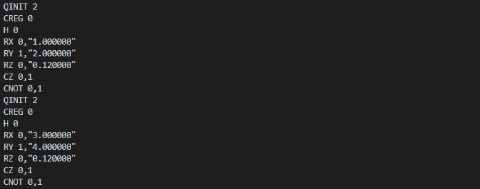

可变量子逻辑门
======================
要在VQNet中使用量子操作 ``qop`` 或 ``qop_pmeasure`` ，就必须要包含可变量子线路(``VQC``)，而可变量子逻辑门则是构成 ``VQC`` 的基本单位。 可变量子逻辑门(``VariationalQuantumGate``，别名: ``VQG``)，内部维护着一组变量参数以及一组常量参数。
在构造 ``VQG`` 的时候只能对其中一组参数进行赋值。若含有一组常量参数，则可以通过 ``VQG`` 生成含确定参数的普通量子逻辑门, 若含有变量参数，则可以动态修改参数值，并生成对应的参数的普通量子逻辑门。

目前在QPanda::Variational中定义了如下可变量子逻辑门，它们都继承自 ``VQG`` 。

===========================  ========== 
 VQG                           别名
===========================  ==========  
VariationalQuantumGate_H      VQG_H
VariationalQuantumGate_RX     VQG_RX
VariationalQuantumGate_RY     VQG_RY
VariationalQuantumGate_RZ     VQG_RZ
VariationalQuantumGate_CNOT   VQG_CNOT
VariationalQuantumGate_CZ     VQG_CZ
===========================  ========== 

接口介绍
-------------

我们可以通过可变量子逻辑门的别名，来使用可变量子逻辑门。我们可以向需要传入参数的可变量子逻辑门中传入变量参数，
例如我们对可变量子逻辑门RX和RY传入变量参数x和y。也可以对可变量子逻辑门传入常量参数，例如RZ我们传入了一个常量参数0.12。
我们可以通过修改变量的参数，从而来改变可变量子逻辑门中的参数。

.. code-block:: cpp

    MatrixXd m1(1, 1);
    MatrixXd m2(1, 1);
    m1(0, 0) = 1;
    m2(0, 0) = 2;

    var x(m1);
    var y(m2);
    
    VQC vqc;
    vqc.insert(VQG_H(q[0]));
    vqc.insert(VQG_RX(q[0], x));
    vqc.insert(VQG_RY(q[1], y));
    vqc.insert(VQG_RZ(q[0], 0.12));
    vqc.insert(VQG_CZ(q[0], q[1]));
    vqc.insert(VQG_CNOT(q[0], q[1]));

    QCircuit circuit1 = vqc.feed();

    m1(0, 0) = 3;
    m2(0, 0) = 4;

    x.setValue(m1);
    y.setValue(m2);

    QCircuit circuit2 = vqc.feed();

实例
----------

.. code-block:: cpp

    #include "QPanda.h"
    #include "Variational/var.h"

    int main()
    {
        using namespace QPanda;
        using namespace QPanda::Variational;

        constexpr int qnum = 2;

        QuantumMachine *machine = initQuantumMachine(CPU_SINGLE_THREAD);
        auto q = machine->allocateQubits(qnum);

        MatrixXd m1(1, 1);
        MatrixXd m2(1, 1);
        m1(0, 0) = 1;
        m2(0, 0) = 2;

        var x(m1);
        var y(m2);

        VQC vqc;
        vqc.insert(VQG_H(q[0]));
        vqc.insert(VQG_RX(q[0], x));
        vqc.insert(VQG_RY(q[1], y));
        vqc.insert(VQG_RZ(q[0], 0.123));
        vqc.insert(VQG_CZ(q[0], q[1]));
        vqc.insert(VQG_CNOT(q[0], q[1]));

        QCircuit circuit = vqc.feed();
        QProg prog;
        prog << circuit;

        std::cout << transformQProgToQRunes(prog, machine) << std::endl << std::endl;

        m1(0, 0) = 3;
        m2(0, 0) = 4;

        x.setValue(m1);
        y.setValue(m2);

        QCircuit circuit2 = vqc.feed();
        QProg prog2;
        prog2 << circuit2;

        std::cout << transformQProgToQRunes(prog2,machine) << std::endl;

        return 0;
    }

