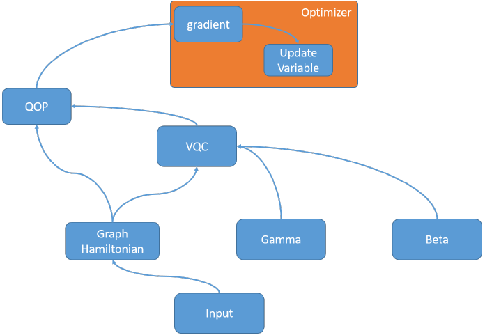
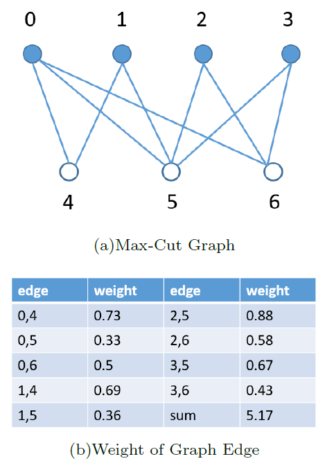
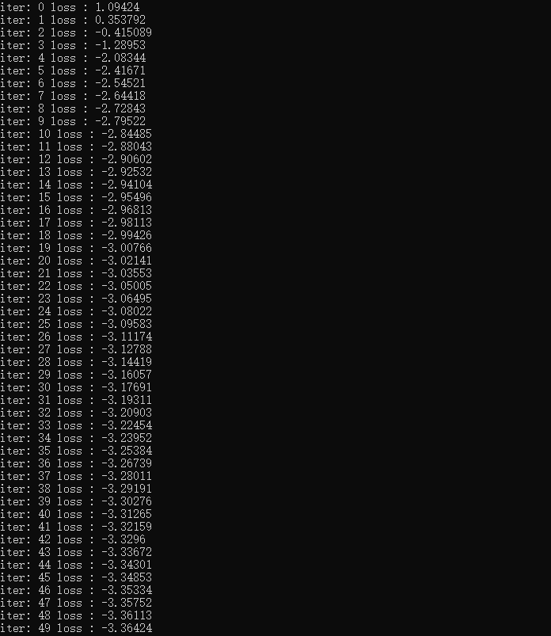
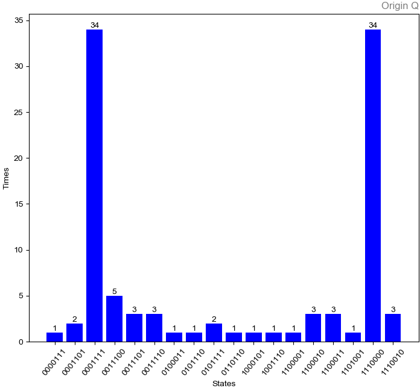

综合示例
============

QAOA
-----------

``QAOA`` 是众所周知的量子经典混合算法。
对于n对象的MAX-CUT问题，需要n个量子位来对结果进行编码，其中测量结果（二进制串）表示问题的切割配置。

我们通过 ``VQNet`` 可以有效地实现 ``MAX-CUT`` 问题的 ``QAOA`` 算法。 VQNet中QAOA的流程图如下所示。

我们给定一个MAX-CUT的问题如下

首先，我们输入 ``MAX-CUT`` 问题的图形信息，以用来构造相应的问题哈密顿量。 

.. code-block:: python

    problem = {'Z0 Z4':0.73,'Z0 Z5':0.33,'Z0 Z6':0.5,'Z1 Z4':0.69,'Z1 Z5':0.36,
           'Z2 Z5':0.88,'Z2 Z6':0.58,'Z3 Z5':0.67,'Z3 Z6':0.43}

然后，使用哈密顿量和待优化的变量参数beta和gamma，构建 ``QAOA`` 的vqc。 
``QOP`` 的输入参数是问题哈密顿量、``VQC`` 、 一组量子比特和量子运行环境。``QOP`` 的输出是问题哈密顿量的期望。 
在这个问题中，损失函数是问题哈密顿量的期望，因此需要最小化 ``QOP`` 的输出。 
我们通过使用梯度下降优化器 ``MomentumOptimizer`` 来优化vqc中的变量beta和gamma。

.. code-block:: python

    from pyqpanda import *

    def oneCircuit(qlist, Hamiltonian, beta, gamma):
        vqc=VariationalQuantumCircuit()
        for i in range(len(Hamiltonian)):
            tmp_vec=[]
            item=Hamiltonian[i]
            dict_p = item[0]
            for iter in dict_p:
                if 'Z'!= dict_p[iter]:
                    pass
                tmp_vec.append(qlist[iter])
                
            coef = item[1]
            
            if 2 != len(tmp_vec):
                pass
            
            vqc.insert(VariationalQuantumGate_CNOT(tmp_vec[0], tmp_vec[1]))
            vqc.insert(VariationalQuantumGate_RZ(tmp_vec[1], 2*gamma*coef))
            vqc.insert(VariationalQuantumGate_CNOT(tmp_vec[0], tmp_vec[1]))
                
        for j in qlist:
            vqc.insert(VariationalQuantumGate_RX(j,2.0*beta))
        return vqc

    if __name__=="__main__":    

        Hp = PauliOperator(problem)
        qubit_num = Hp.getMaxIndex()

        machine=init_quantum_machine(QMachineType.CPU_SINGLE_THREAD)
        qlist = machine.qAlloc_many(qubit_num)

        step = 4

        beta = var(np.ones((step,1),dtype = 'float64'), True)
        gamma = var(np.ones((step,1),dtype = 'float64'), True)

        vqc=VariationalQuantumCircuit()

        for i in qlist:
            vqc.insert(VariationalQuantumGate_H(i))

        for i in range(step):    
            vqc.insert(oneCircuit(qlist,Hp.toHamiltonian(1),beta[i], gamma[i]))

        loss = qop(vqc, Hp, machine, qlist)  
        optimizer = MomentumOptimizer.minimize(loss, 0.02, 0.9)

        leaves = optimizer.get_variables()

        for i in range(100):
            optimizer.run(leaves, 0)
            loss_value = optimizer.get_loss()
            print("i: ", i, " loss:",loss_value )

        # 验证结果    
        prog = QProg()
        qcir = vqc.feed()
        prog.insert(qcir)
        directly_run(prog)

        result = quick_measure(qlist, 100)
        print(result)

我们将测量的结果绘制出柱状图，可以看到'0001111'和'1110000'这两个比特串测量得到的概率最大，也正是我们这个问题的解。

