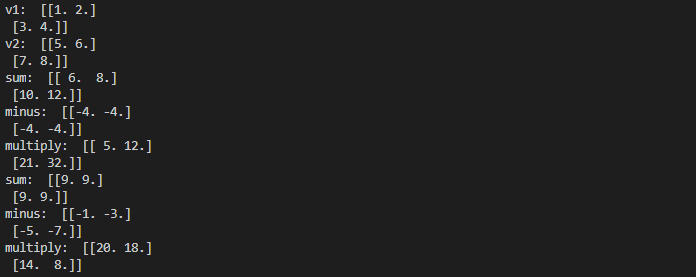

变量
=========

变量类是实现符号计算的用户类，用于存储特定混合量子经典网络的变量。 通常任务是优化变量以最小化成本函数。 变量可以是标量，矢量或矩阵。

变量具有树形结构，它可以包含子节点或父节点。 如果变量没有子节点，那么我们称之为叶子节点。 我们可以将变量设置为特定值，另一方面，如果变量的所有叶子节点都已设置了值，我们也可以获得该变量的值。

接口介绍
--------------

在QPanda中，我们需要引入 ``QPanda::Variational`` 命名空间才能使用变量相关的类。我们可以通过传入一个浮点型的数据来构造一个标量变量，
也可以通过 ``Eigen`` 库中的 ``MatrixXd`` 类型数据的构造一个矢量或矩阵变量。

.. code-block:: cpp

    using namespace QPanda::Variational;

    var const_var(1);

    MatrixXd m1(2, 2);
    m1 << 1, 2, 3, 4;

    MatrixXd m2(2, 2);
    m2 << 5, 6, 7, 8;

    var var1(m1);
    var var2(m2);

.. note:: 

    在定义变量的时候，可以定义变量的类型是否可以微分，默认情况下我们定义的变量的类型都是不可微分的，不可微分的变量相当于 ``placeholder``。
    定义可微分的变量时，需要指定构造函数的第二个参数为true, 例如：var v1(1, true)。

我们可以先定义计算对应的表达式，表达式由变量之间进行加减乘除操作或其它操作组成，表达式也是一个变量。

.. code-block:: cpp
   
    var v1(10);
    var v2(5);
  
    var add = v1 + v2;
    var minus = v1 - v2; //var minus(op_type::minus, {v1, v2});
    var multiply = v1 * v2;
    var divide = v1 / v2;

我们可以在不改变表达式结构的情况下，通过改变某个变量的值，即可得到不同的计算结果。我们可以调用变量的 ``_eval`` 接口，来计算该变量当前的值。

.. code-block:: cpp
   
    var v1(1);
    var v2(2);
    
    var add = v1 + v2;

    std::cout << add._eval() << std::endl;// 输出为3

    MatrixXd m(1, 1);
    m << 3;
    v1.setValue(m);

    std::cout << add._eval() << std::endl;// 输出为5

实例
---------------

下面我们将以更多的示例来展示变量类相关接口的使用。

.. code-block:: cpp

    #include "Variational/var.h"

    int main()
    {
        using namespace QPanda::Variational;

        var const_var(1);

        MatrixXd m1(2, 2);
        m1 << 1, 2, 3, 4;

        MatrixXd m2(2, 2);
        m2 << 5, 6, 7, 8;

        var var1(m1);
        var var2(m2);

        var sum = var1 + var2;
        var minus(op_type::minus, {var2, var1});
        var multiply = var1 * var2;

        MatrixXd dx = MatrixXd::Ones(2, 2);

        std::cout << "const_var: " << std::endl << const_var.getValue() << std::endl;
        std::cout << "var1: " << std::endl << var1.getValue() << std::endl;
        std::cout << "var2: " << std::endl << var2.getValue() << std::endl;
        std::cout << "sum: "  << std::endl << sum._eval() << std::endl;
        std::cout << "    op_type: " << int(sum.getOp()) << std::endl;
        std::cout << "    NumOpArgs: " << int(sum.getNumOpArgs()) << std::endl;
        std::cout << "minus: "  << std::endl << minus._eval() << std::endl;
        std::cout << "    op_type: " << int(minus.getOp()) << std::endl;
        std::cout << "    NumOpArgs: " << int(minus.getNumOpArgs()) << std::endl;
        std::cout << "multiply: "  << std::endl << multiply._eval() << std::endl;
        std::cout << "    op_type: " << int(multiply.getOp()) << std::endl;
        std::cout << "    NumOpArgs: " << int(multiply.getNumOpArgs()) << std::endl;
        std::cout << "Derivative multipy to var1:" <<std::endl<< multiply._back_single(dx, 0)<<std::endl;
        std::cout << "Derivative multipy to var2:" <<std::endl<< multiply._back_single(dx, 1)<<std::endl;

        MatrixXd m3(2, 2);
        m3 << 4, 3, 2, 1;
        var1.setValue(m3);

        std::cout << "sum: "  << std::endl << sum._eval() << std::endl;
        std::cout << "minus: "  << std::endl << minus._eval() << std::endl;
        std::cout << "multiply: "  << std::endl << multiply._eval() << std::endl;
        std::cout << "matrix_var1 UseCount: " << var1.getUseCount() << std::endl;

        return 0;
    }

