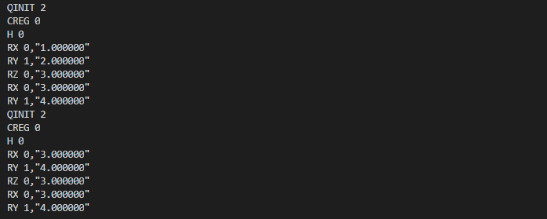

可变量子线路(VQC)
===================

在 ``VQNet`` 中量子操作 ``qop`` 和 ``qop_pmeasure`` 都需要使用可变量子线路作为参数。 
可变量子线路(``VariationalQuantumCircuit``，别名 ``VQC``)是用来存储含有可变参数的量子线路信息，
``VQC`` 主要由可变量子逻辑门（``VQG``）组成。使用时可以向 ``VQC`` 插入普通量子逻辑门，或者普通量子线路、以及 ``VQG`` 或另外一个 ``VQC``，
在插入普通量子逻辑门或普通量子线路时，其在内部将普通量子逻辑门转换成一组含有固定参数的 ``VQG``。
变量可以和 ``VQC`` 中的不同 ``VQG`` 相关，``VQC`` 对象会保存变量和 ``VQG`` 之间的映射。

接口介绍
-------------

.. cpp:class:: VariationalQuantumCircuit

   .. cpp:function:: VariationalQuantumCircuit()

        **功能**
            构造函数。
        **参数**
            无

   .. cpp:function:: VariationalQuantumCircuit(const VariationalQuantumCircuit& vqc)
      
        **功能**
            拷贝构造函数。
        **参数**
            - vqc 可变量子线路

   .. cpp:function:: VariationalQuantumCircuit(QCircuit circuit)
      
        **功能**
            通过普通量子线路进行构造。
        **参数**
            - circuit 普通量子线路

   .. cpp:function:: std::vector<var> &get_vars()

        **功能**
            获得可变量子线路内部维护的变量。
        **参数**
            无
        **返回值**
            可变量子线路内部维护的变量。

   .. cpp:function:: QCircuit feed(const std::vector<std::tuple<std::weak_ptr<VariationalQuantumGate>, size_t, double>>) const

        **功能**      
            对可变量子线路进行赋值。
        **参数**
            - gate_offsets 可变量子逻辑门中量子比特对应的参数偏移值
        **返回值**
            普通量子线路。

 .. cpp:function:: QCircuit feed() const

        **功能**
            对可变量子线路进行赋值。
        **参数**
            无
        **返回值**
            普通量子线路。
       
 .. cpp:function:: std::vector<std::weak_ptr<VariationalQuantumGate>> get_var_in_which_gate(const var& _var) const

        **功能**
            获取变量在可变量子线路中对应的可变量子逻辑门。
        **参数**
            - _var 变量
        **返回值**
            变量在可变量子线路中对应的可变量子逻辑门。

 .. cpp:function:: template<typename VQG_Ty> VariationalQuantumCircuit& insert(VQG_Ty gate)

        **功能**
            插入可变量子逻辑门。
        **参数**
            - gate 可变量子逻辑门
        **返回值**
            可变量子线路本身。

实例
-------------

.. code-block:: cpp

    #include "QPanda.h"
    #include "Variational/var.h"

    int main()
    {
        using namespace std;
        using namespace QPanda;
        using namespace QPanda::Variational;

        constexpr int qnum = 2;

        QuantumMachine *machine = initQuantumMachine(QuantumMachine_type::CPU_SINGLE_THREAD);
        std::vector<Qubit*> q;
        for (int i = 0; i < qnum; ++i)
        {
            q.push_back(machine->Allocate_Qubit());
        }

        MatrixXd m1(1, 1);
        MatrixXd m2(1, 1);
        m1(0, 0) = 1;
        m2(0, 0) = 2;

        var x(m1);
        var y(m2);

        VQC vqc;
        vqc.insert(VQG_H(q[0]));
        vqc.insert(VQG_RX(q[0], x));
        vqc.insert(VQG_RY(q[1], y));

        QCircuit circuit = vqc.feed();
        QProg prog;
        prog << circuit;

        std::cout << qProgToQRunes(prog) << std::endl << std::endl;

        auto gates = vqc.get_var_in_which_gate(x);

        int pos = shared_ptr<VariationalQuantumGate>(gates[0])->var_pos(x);

        vector<tuple<weak_ptr<VariationalQuantumGate>, size_t, double>> plus;
        plus.push_back(make_tuple(gates[0], pos, 3));

        QCircuit circuit2 = vqc.feed(plus);
        QProg prog2;
        prog2 << circuit2;

        std::cout << qProgToQRunes(prog2) << std::endl;

        return 0;
    }

