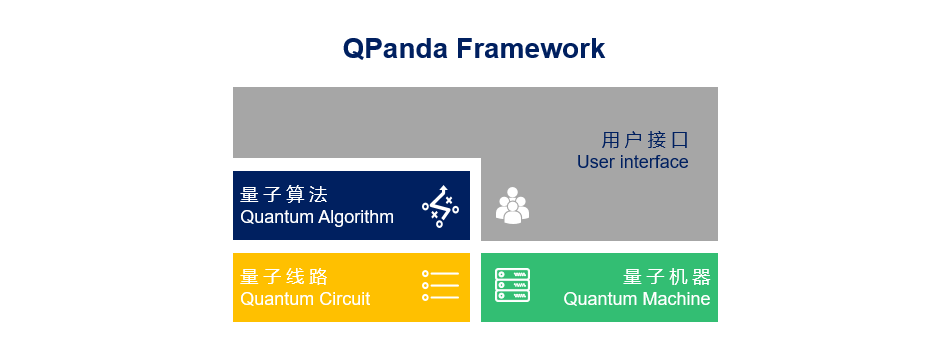
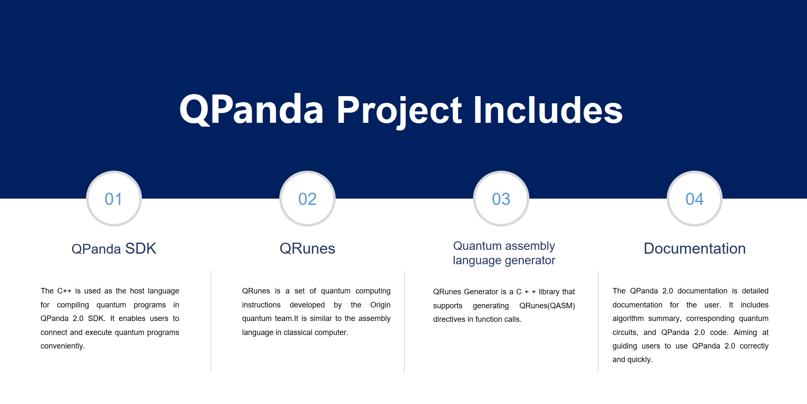

## QPanda 2

QPanda (**Q**uantum **P**rogramming **A**rchitecture for **N**ISQ **D**evice **A**pplications) is a library for quantum computing which can be applied for realizing various quantum algorithms. QPanda is mainly written in C++, and can be extended to Python.

## Documentation
Documentation is hosted at https://qpanda-2.readthedocs.io/zh_CN/master/

## The Design Ideas of QPanda 2

The design of **QPanda 2** is forward-looking, considering that quantum computing will flourish and be widely applied in the future. So QPanda 2 did the following consideration when it was designed:

- Full series compatibility.

- Standard architecture.

- Standardized quantum machine model.

## The Project Includes：

-   **QPanda SDK**：

The C++ is used as the host language for compiling quantum programs in QPanda 2 SDK. It enables users to connect and execute quantum programs conveniently.

-   **QRunes**：

QRunes is a set of quantum computing instructions developed by the Origin quantum team.It is similar to the assembly language in classical computer.

-   **QRunes(QASM) Generator**：

QRunes Generator is a C + + library that supports generating QRunes(QASM) directives in function calls.

-   **[QPanda Documentation](./Documentation/README.md)**：

The QPanda 2 documentation is detailed documentation for the user. It includes algorithm summary, corresponding quantum circuits, and QPanda 2 code. Aiming at guiding users to use QPanda 2 correctly and quickly.

## Installation and configuration

-   **[Click for detailed！](./Documentation/Doc/3.Installation_en.md)**：

 ## License
 Apache License 2.0

 Copyright (c) 2017-2018 By Origin Quantum Computing. All Right Reserved.
